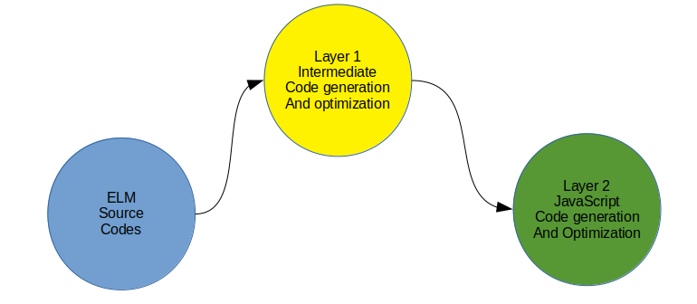
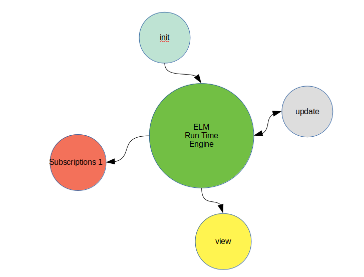

# elm-architecture-explain

In this README, ELM architecture is reviewed in the developer's way and explain the event flow sequence so that we can quickly align the business logic to the ELM event flow and architecture.

I try to compare with React.js in case of need so that the concept is explained more clearly if you are familiar with React.js framework.

## Overview

**ELM** is another web development framework like Facebook React and Google Angular but it is functional language like Haskell and super simple and pragmatic to the developers.

**ELM** is the result of the thesis of the genious young havard student **Evan Czaplicki**, which was published on 03/30/2012.

**ELM** offers you the best developer experience to enjoy concurrent FRP (Functional React Programming). If you like Mobx.js, you will love ELM.

**ELM** offers the developers the concurrent functional reactive programming (**FRP**) experience in the succinct and pragmatic way. The data immutability and virtual DOM strategy and two-tier codes optimiation make the compiled JS file super tiny in **size** and super speedy in **performance**.

## Arhcitecture

### ELM code compilation Dialgram




**ELM** language is very expressive. When compiling to Javascript, it take two steps. 

First, it transforms ELM source codes into an intermediate codes. the purpose is to optimize the source codes and prepare the "Cleanup" codes for next layer compilation.

Second, it leverage HTML5 and web javascript available capability to further optimize and transform the intermediate codes into javascript.

For the detail, please reference to the Evan Czaplicki's thesis (2012) "Concurrent FRP"





**ELM** is a declarative programming language for Web UI development. **ELM** power web developers to describe UI layout, What interaction, **ELM** runtime does the heavy lifting to figure out how to render UI and carry out the UI interaction.

**ELM** is an **opinioned** web framework, which requires to have the following functions defined at the bootstrap elm file (e.x. Main.elm)

* main
* init
* update
* subscriptions
* view

#### main

This is bootstrap function, where you instruct ELM runtime to do the following:

* when initializing, call my init function
* when new events are dispatched, call my update function
* when your update or init has side effect, the runtime need to notify you by call your subscriptions.
* after updates and side effects are completed, the ELM runtime calls your view to get your view definiton (**what**) and render your layout defintion to the web browser. 

If you want ELM runtime to render view inside that element. You need pass on that element node instance into init().

```elm
  main =
  Browser.element
    { init = init
    , view = view
    , update = update
    , subscriptions = subscriptions
    }
```


if you develop Single Page Application (SPA), you want the ELM runtime to render the whole page. Mightbe the page title and body are different for each page. In this case, you need to use Browser.application function.


```elm
main =
    Browser.application
        { init = init
        , view = view
        , update = update
        , subscriptions = subscriptions
        , onUrlChange = OnWebUrlChange
        , onUrlRequest = OnWebUrlRequest
        }
```

In the following section "SPA", when and how to use Broswer.element and Browser.application are explained. 

Here, **OnWebUrlChange** and **OnWebUrlRequest** are ELM message definition (they are function too).

For ELM web application, you want express the browser event in the human-readable way as shown blown:

```elm
type Msg 
  = TransferMoney Int
  |  SaveProfile
```

* SaveProfile is a function () -> Msg
* TransferMoney is a function (Int) -> Msg

Let's say you have a button call "Save Profile" as shown here

```elm
view model =
  div [] [
    button [onClick SaveProfile] [text "Save Profile"]
  ]
```
when the users click this button, the ELM runtime will translate the button click event to SaveProfile message and call your update() function and pass in this message and your application **state**


#### init
You need to initialize your application **state** (In React, you will initialize root store during the bootstrap phase). 

You might also call the backend API to preload data. (you might call this API in react component constructor).

The function always returns a tuple of (AppState, Cmd Msg). In ELM, we use **Model** as Application State, we define Custom Type **Msg** as Messges that we ask **ELM** runtime to do.

##### Browser.element
```elm
init: flags -> (Model, Cmd Msg)
```

#### Browser.application
```elm
init: url key -> (Model, Cmd Msg)
```

#### update
ELM calls update() when the runtime dispatches event messages. Here is update contract:

```elm
update: msg model -> (Model, Cmd Msg)
```

Inside your init() and update(), you can create/update Model Instance and define a batch of command messages and return it.

The pseudocodes are shown below:
```elm
update msg model =  
  let 
    updateModel 
      = { model 
        | someState1 = Loading
        , someState2 = Init }
  in 
    (updatedModel, Cmd.batch( task1, task2, task3, ...))
```

**note** in subscriptions() definition, you can also instruct the ELM runtime to dispatch the messages to your update() when your interested things happen.


#### subscriptions
In this function, you tell ELM runtime what side effect and interest that your app want to know when certain things happen. In other words, any events that 
are generates outside your program can be subscribed in this function, such as 
window resize event.

For example, you can use elm/time package every() function to tell ELM runtime to call your update() every second with the predefined message TimeUp.

```elm
type Msg 
  = TimeUp

subscriptions =
  Time.every 1000 TimeUp
```
Note that you can batch multiple subscriptions.

```elm
type Msg 
  = TimeUp
  | TimeDown 

subscriptions =
  Sub.batch
    ( Time.every 1000 TimeUp
    , Time.every 6000 TimeDown)
  
```

#### view
ELM calls view() after update() and subscriptions() are called.

```elm

view: Model -> Html msg | Document msg

```
for Brower.element, the view() needs return Html msg. for Browser.application and Browser.document, the view() needs return Document msg. 

In view(), you design UX layout and declare user interactions through ELM HTML elements like (div, span, etc.)

## SPA

In ELM, there is not any router-specific package like **react-router**. Browser package exposes 3 functions that allow you to update browser without reloading.

* Browser.element
* Browser.document
* Browser.application

Browser.element and Browser.document does not provide browser navigation hook so that you can bind to them and take action based on the navigation event.

You can craft navigation logic with them or crack the source codes to see how it is implemented. Nothing is wrong with it but not recommended.

Browser.application exposes two browser history navigation related event to the developer.

* **onUrlRequest**: UrlRequest -> msg
* **onUrlChange**: Url -> msg

When a hyperlink ```<a href="/somepath">somepath</a>``` is clicked, ELM runtime will raise onUrlRequest event, Your hooked implementation is called with the pass-in parameter UrlRequest, like preRoute event. 

You do whatever you want to do, like saving current page screen scroll position, calling web service API, validate current form, etc. 

And then you need to call  Browser.Navigation pushUrl to add the url entry in browser.history object. It dispatches **onUrlChange** event message to the update(). 

Inside update(), you pattern-match your **onUrlChange** message to implement your next application logic based on the pass-in Url.

>It is nice to have router package implemented to add an abstract layer so that the developers are not directly calling this lower-level API for routing purpose.

## Some considations

### OOD vs Functional Design

From the **React.js** world, it is very easy to draw the boundary around UI layout. In addition, the highly encapsulated component model can store its' own **state**. The developers are happy with this simplicity but that might cause component out of sync or bug-prone. 

The developers have to tackle the following issues:

* state out of sync.
* data mutability issue.
* component life of cycle related issue.
* javascript "this" reference issue.
* code base sizing and code splitting.
* concern too much at all level. 

To solve aboved metioned issues, the developers has to turn 3rd party's libraries, such as 

* Redux or MobX State Tree or Mobx
* React-Router
* React-Thunk or React-Saga (backend API integraiton)
* React-Immutable
* React-ReSelect to handle data set rendering 
* Others,

The moment when you add up all those 3rd party's library, your codebase might hit 1.5MB very easily.

From the **ELM** world, the developer do not have these concerns due to the facts:

* One truth of source, the application state (**Model**) at the main entry level
* the state is immutable by nature
* time travelling is by default
* concern less. Only need to know **WHAT**
* code base super tiny. code split not needed although you can do it.

But we still have some concerns when using ELM:

* it is a learning curve. anything is function. it is not easy to simulate the real-world knowledge, in which OOD is better.

* It is message-driven centric.  In some way, the similarity is very high between ELM and Erlang/Elxir

* The popularity is not on top rank although the principle and concept of ELM are very superb, Alibaba **dva.js**, **Redux** and some others borrow most idea of it.

* The ELM 3rd party's libraris are not huge comparing with React.js, Angular, Vue.js. Thanks ELM core team to do the heavy lifting, we still can use the 3rd party JS libraries through ELM port. That is against of the ELM goal as declarative language.

## Tips and understanding

### Single custom type optimization

For the single custom type variant, the compiler will optimize it by trimming out the custom type name for example:

```elm
  type User = 
    User {
      id : Int,
      name : String
    }
```
The compiler will compile it to {id : Int, name : String} without User
