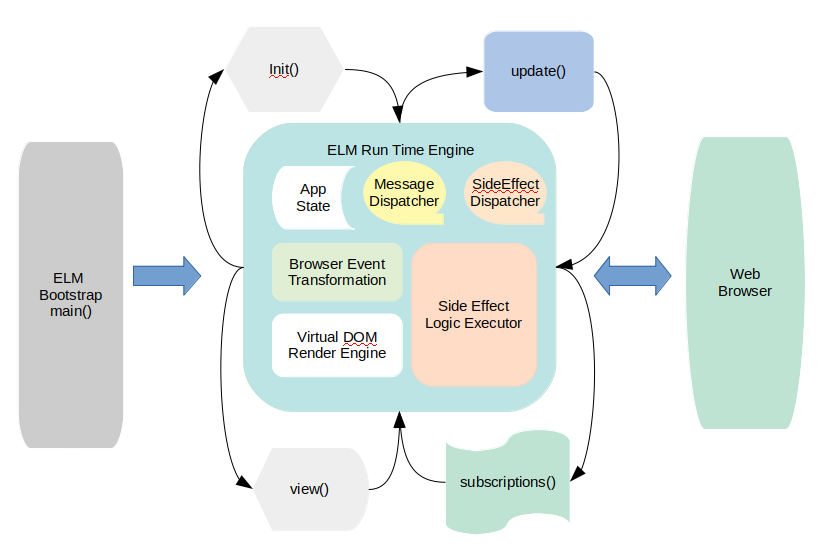

# elm-architecture-explain

In this README, ELM architecture is reviewed in the developer's way and explain the event flow sequence so that we can quickly align the business logic to the ELM event flow and architecture.

I try to compare with React.js in case of need so that the concept is explained more clearly if you are familiar with React.js framework.

## Overview

**ELM** is another web development framework like Facebook React and Google Angular but it is functional language like Haskell and super simple and pragmatic to the developers.

**ELM** is the result of the thesis of the genious young havard student **Evan Czaplicki**, which was published on 03/30/2012.

**ELM** offers you the best developer experience to enjoy concurrent FRP (Functional React Programming). If you like Mobx.js, you will love ELM.

**ELM** offers the developers the concurrent functional reactive programming (**FRP**) experience in the succinct and pragmatic way. The data immutability and virtual DOM strategy and two-tier codes optimiation make the compiled JS file super tiny in **size** and super speedy in **performance**.

## Arhcitecture

### ELM code compilation Dialgram


**ELM** language is very expressive. When compiling to Javascript, it take two steps. 

First, it transforms ELM source codes into an intermediate codes. the purpose is to optimize the source codes and prepare the "Cleanup" codes for next layer compilation.

Second, it leverage HTML5 and web javascript available capability to further optimize and transform the intermediate codes into javascript.

For the detail, please reference to the Evan Czaplicki's thesis (2012) "Concurrent FRP"





**ELM** is a declarative programming language for Web UI development. **ELM** power web developers to describe UI layout, What interaction, **ELM** runtime does the heavy lifting to figure out how to render UI and carry out the UI interaction.

**ELM** is an **opinioned** web framework, which requires to have the following functions defined at the bootstrap elm file (e.x. Main.elm)

* main
* init
* update
* subscriptions
* view

#### main

This is bootstrap function, where you instruct ELM runtime to do the following:

* when initializing, call my init function
* when new events are dispatched, call my update function
* when your update or init has side effect, the runtime need to notify you by call your subscriptions.
* after updates and side effects are completed, the ELM runtime calls your view to get your view definiton (**what**) and render your layout defintion to the web browser. 

If the bootstrap can target HTML element, in this case, you want ELM runtime to render view inside that element. You need pass on that element node instance into init().

```elm
  main =
  Browser.element
    { init = init
    , view = view
    , update = update
    , subscriptions = subscriptions
    }
```


if you develop Single Page Application (SPA), you want to ELM runtime to render the whole page. Mightbe the page title and body are different for each page. In this case, you need to use Browser.application function.


```elm
main =
    Browser.application
        { init = init
        , view = view
        , update = update
        , subscriptions = subscriptions
        , onUrlChange = OnWebUrlChange
        , onUrlRequest = OnWebUrlRequest
        }
```

In the following section "SPA", when and how to use Broswer.element and Browser.application are explained. 

Here, **OnWebUrlChange** and **OnWebUrlRequest** are ELM message definition (they are function too).

For ELM web application, you want express the browser event in the human-readable way as shown blown:

```elm
type Msg 
  = TransferMoney Int
  |  SaveProfile
```

SaveProfile is a function () -> Msg
TransferMoney is a function (Int) -> Msg

that say you a button call "Save Profile" as shown here

```elm
view model =
  div [] [
    button [onClick SaveProfile] [text "Save Profile"]
  ]
```
when the users click this button, the ELM runtime will translate the button click event to SaveProfile message and call your update() function and pass in this message and your application **state**


#### init
You need to initialize your application **state** (In React, you will initialize root store during the bootstrap phase). 

You might also call the backend API to preload data. (you might call this API in react component constructor).

##### Browser.element
```elm
init: flags -> (Model, Cmd Msg)
```

#### Browser.application
```elm
init: url key -> (Model, Cmd Msg)
```

#### update


#### subscriptions


#### view